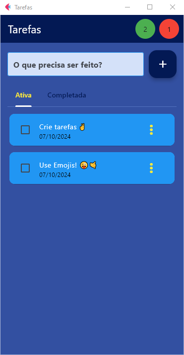
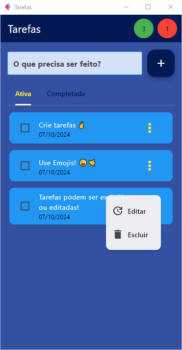

# Flet - Lista de Tarefas.    

### Feito com Python🐍 e Flet





## 📙Descrição deste Projeto:

Uma aplicação de Lista de Tarefas criada para fins didáticos, é totalmente funcional, ela é o resultado de estudo do framework Flet.  

Esta aplicação eu compilei para Android(apk), [veja como](https://flet.dev/docs/publish/android/#flet-build-apk), mas este mesmo código poderá ser compilado para multiplataforma(Mobile, WEB ou PC), basta seguir as exigências do Framework na [página oficial](https://flet.dev/).

## 🛠️ Os requisitos do projeto:

Para executar este projeto localmente, você precisará ter instalado:  

#### *Nos meus projetos eu sempre uso o Poetry, mas sinta-se livre para usar o gerenciador de pacotes de sua preferência.

- Poetry ^1.8.3 (Gerenciador de pacotes do Python)  
- Mas pode-se usar também o PIP ou PIPX  

### Dependências de projeto:
- Python ^3.12
- Flet ^0.24.1
- SQLite3

### Dependência de desenvolvimento:
- Taskipy ^1.13.0 (task runner para projetos Python)

### 🖥️ Instalação:

1. Clone o repositório:
```bash
git clone https://github.com/fspjonny/tarefas.git
```

2. Vá para o diretório da aplicação:
```bash
cd tarefas
```

3. Crie um ambiente virtual com o Poetry:
```
poetry shell
```

4. Para instalar as dependências do projeto:
```
poetry install
```

### 🚀 Executando a aplicação:

Na pasta da sua aplicação, usando o console do seu sistema operacional ou o console do seu editor de códigos, execute o comando:
```bash
task run
```
Este comando executará o projeto.  

## 👋😃 Obrigado por visitar
